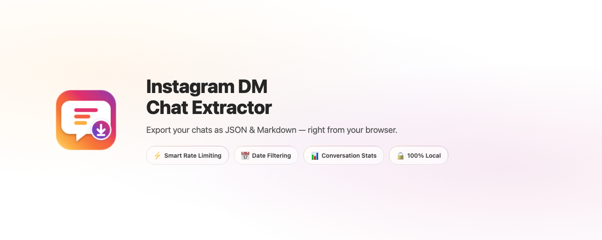
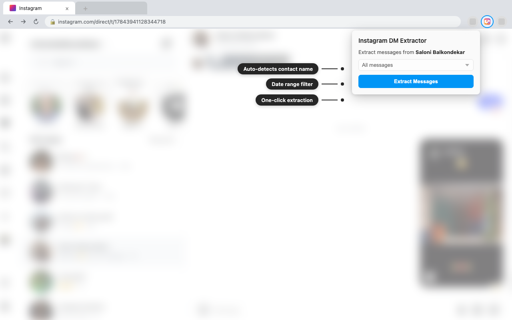
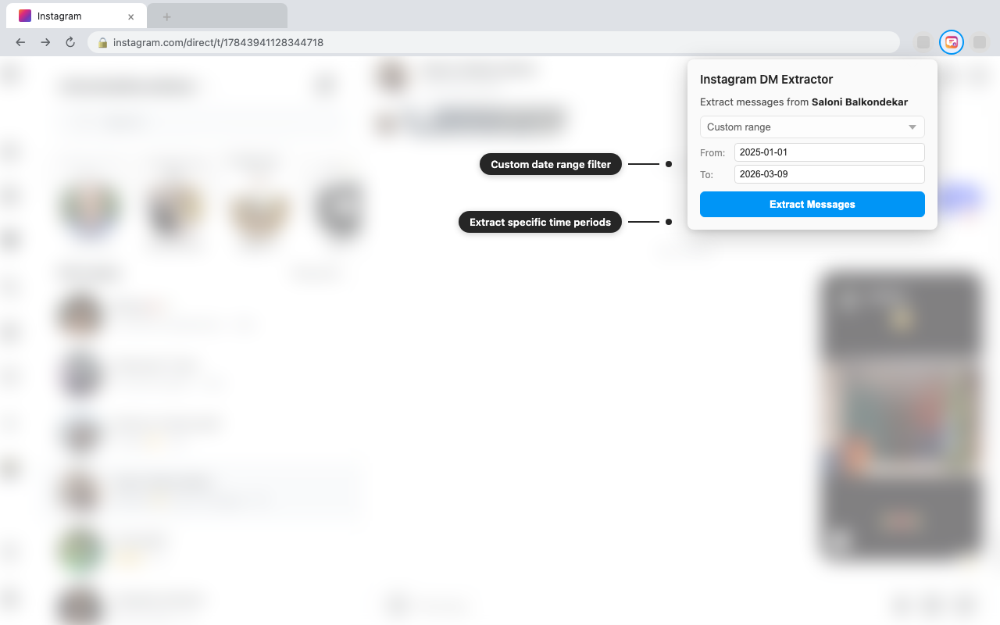
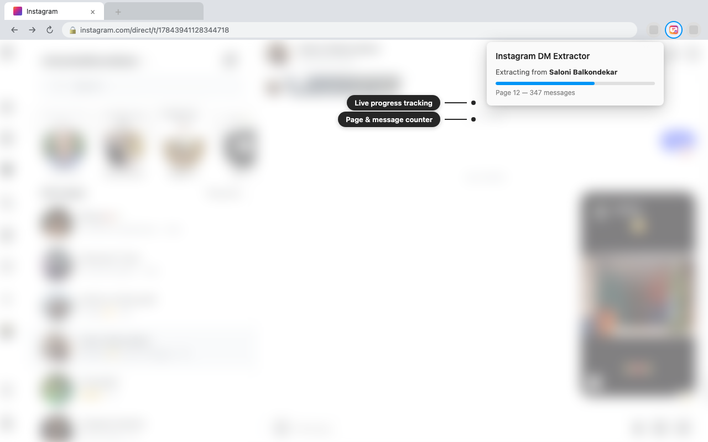
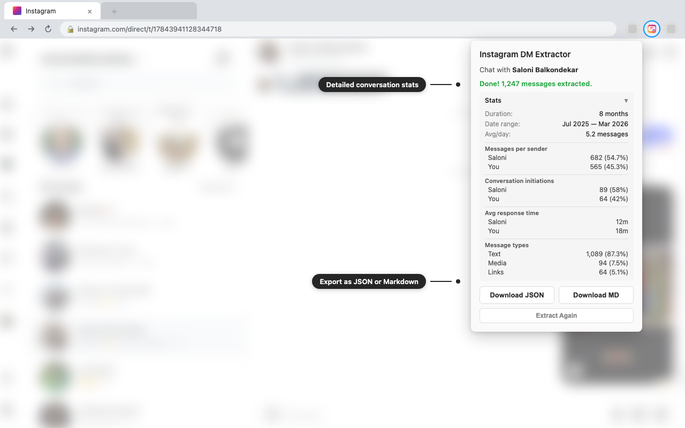

  

  
  
  
  

  

---

## Features

| Feature | Description |
|---|---|
| **Chat name resolution** | Shows the contact name before extraction — no cryptic thread IDs |
| **Date filtering** | All messages, past 1/7/30 days, or a custom range |
| **Adaptive speed** | Starts fast, backs off on rate limits |
| **Stats** | Per-sender counts, response times, conversation initiations, message types |
| **Dual export** | JSON (structured) + Markdown (LLM-ready with metadata header) |

## Screenshots

<table>
  <tr>
    <td align="center"> <em>Open a DM and click Extract</em></td>
    <td align="center"> <em>Filter by custom date range</em></td>
  </tr>
  <tr>
    <td align="center"> <em>Live progress tracking</em></td>
    <td align="center"> <em>Conversation stats and export</em></td>
  </tr>
</table>

## Install

**Chrome / Chromium:**
1. Clone this repo
2. Go to `chrome://extensions` → enable **Developer mode**
3. **Load unpacked** → select the `extension/` folder

**Firefox:**
1. Go to `about:debugging#/runtime/this-firefox`
2. **Load Temporary Add-on** → select `extension/manifest.json`

## Usage

1. Open a DM conversation on [instagram.com](https://www.instagram.com)
2. Click the extension icon
3. Pick a date range → **Extract Messages**
4. Download as **JSON** or **MD**

## How it works

Uses Instagram's web DM API (`/api/v1/direct_v2/threads/`) — the same one the webapp uses. Reads your session cookies to authenticate, paginates through messages, parses 15+ message types, and exports locally. **No data leaves your browser.**

## License

[MIT](LICENSE)
